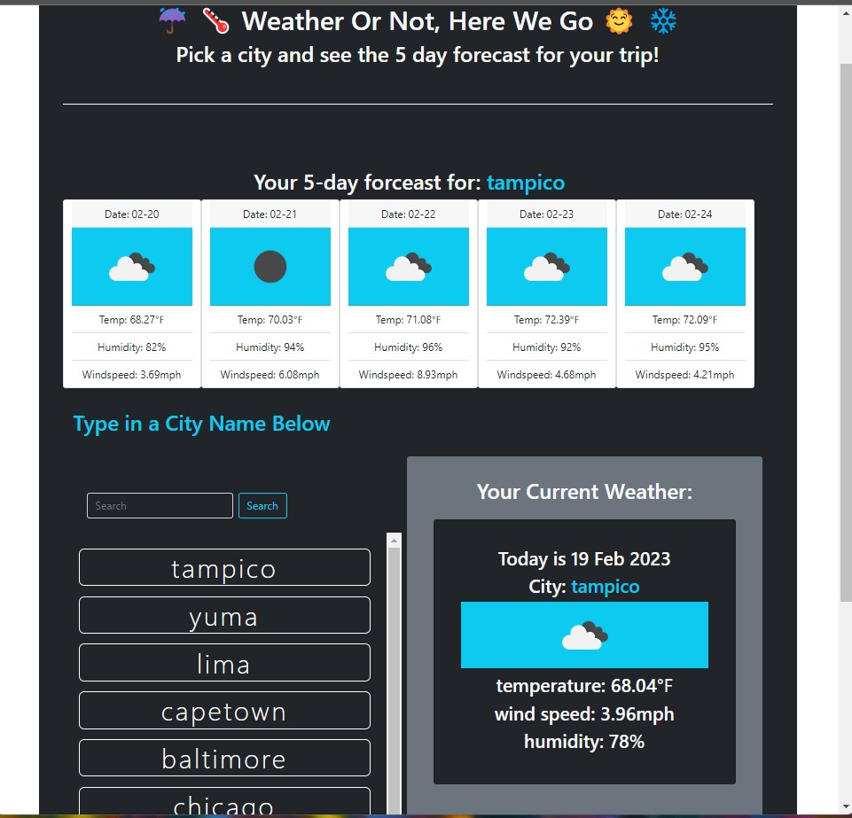

# Module 6 Challenge (Columbia Bootcamp)
[](https://forthebadge.com)  [](https://forthebadge.com) [](https://forthebadge.com) [](https://forthebadge.com) [](https://forthebadge.com) 

## Description

A simple but sophisticated little weather app using the power of 3rd party APIs (openweathermap's geo-locator api, their current-weather api, and their 5-day forecast api), javascript/jQuery, bootstrap/css, html, and a healthy dose of elbow-grease and stick-to-it-ivity. The app's intuitive design invites you to type in the name of a city to get the most important details about the current weather conditions - temp, wind-speed, and humidity, along with an icon specifically based off the exact/current weather code for that city. As if that wasn't enough to knock your socks off, you will also see generated a 5 day forecast for that city with the same level of detail as the current conditions. But wait- there's more! hate typing or can't remember what city you had searched up last time? don't worry! we remembered it for you by saving it to local storage and displaying it for you where you can simply click on it to get completely fresh results for that city yet again! So no worries if you refreshed the page or closed the tab, etc. etc. etc. searched chicago 27 times in the last ten minutes and are freaking out because there are 27 repeats of chicago showing by the search bar? just hit refresh and be amazed when only one remains. We thought of everything, by God! working hard behind the scenes while you type in whatever city your heart could desire. Paris? Lima? Dallas? Chicken? Pizza? yes! those are all cities so go ahead what are you waiting for OMG go to the website already and try it!


Made from scratch using the following acceptance criteria:
```
GIVEN a weather dashboard with form inputs
WHEN I search for a city
THEN I am presented with current and future conditions for that city and that city is added to the search history
WHEN I view current weather conditions for that city
THEN I am presented with the city name, the date, an icon representation of weather conditions, the temperature, the humidity, and the wind speed
WHEN I view future weather conditions for that city
THEN I am presented with a 5-day forecast that displays the date, an icon representation of weather conditions, the temperature, the wind speed, and the humidity
WHEN I click on a city in the search history
THEN I am again presented with current and future conditions for that city
```


The deployed page is: https://jdr8888.github.io/weather-or-not/

The github repo is @ https://github.com/JDR8888/weather-or-not

Screenshot of the page:




# Installation
N/A
# Usage
N/A
# Credits   
  [](https://forthebadge.com) 
  symbol.cc, openweather, 
# License
Please see the repo for license info